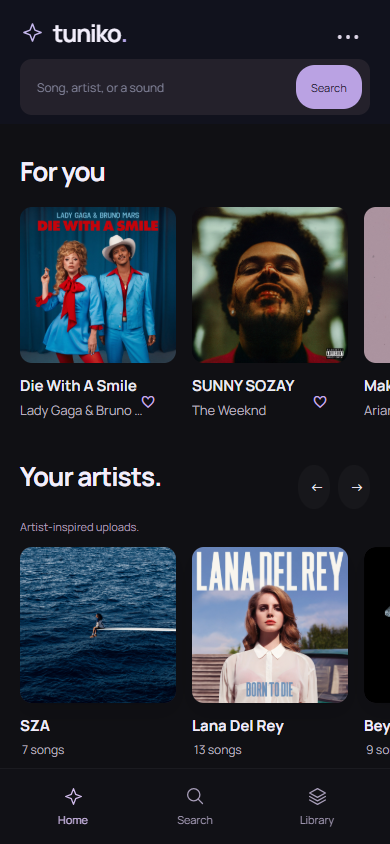

# Tuniko

**Music discovery with a space of your own.**

Tuniko is a phone-first music discovery and listening prototype by **Kristian Gaydov**. Search for songs, explore mood mixes and collections, and customize a movable companion.

**Stage:** First official web release - `0.2.7`

[Open Tuniko](https://KristianKG.github.io/Tunito/) | [Run locally](#getting-started) | [License](#license)

## Preview



*Original web interface. Collections and recommendations vary with available provider uploads and local listening history.*

## About this release

This repository contains the original Tuniko application, including live music discovery, artist collections, search, playlists, mood mixes and the customizable companion. The GitHub Pages site uses the same web build as the local preview.

This is my first project. I've worked on it for around four months since graduating from high school, learning the tools and languages along the way. People I know wanted premium music features but couldn't afford subscriptions; that motivated me to explore a free listening experience with features of its own. The question grew from a small idea into "How can I make it better?"

The catalog is still limited in variety and reliability. I don't currently have funding for a broader licensed catalog. Provider availability and community-upload metadata vary; grouping an upload under an artist's name does not certify that it is an official recording. This is an early release with plenty left to improve.

## Challenges along the way

One of the hardest parts has been finding music that people actually want to listen to and that the app can stream reliably. Adding more providers didn't automatically mean better results: searches could be slow, unrelated tracks could appear, and some listed songs wouldn't play. That made me focus more on relevance and checking availability, while learning that a large licensed catalog is a separate challenge.

The design took several attempts too. Some early versions felt too complicated, so I kept moving toward simpler navigation and a layout that makes sense on a phone. Returning from the full player to browsing without losing the listening experience was one of the details we worked through.

Even the small companion brought unexpected problems. Its accessories didn't always follow its movement or fit its shape, which needed attention as customization grew. Missing or unrelated artwork was another issue: a song list is much harder to recognize when its images aren't right.

These problems have been part of learning how the pieces fit together. Some have been improved, while catalog coverage and verified background playback on phones still need more work. This first demo is a checkpoint, and there's plenty left to improve.

## Features

- Song and artist search with tolerance for small spelling mistakes.
- Artist collections, six mood mixes, recent listening and local recommendations.
- In-page audio, a compact/full player, queue, shuffle, repeat and sleep timer.
- Liked songs, customizable playlists and local audio support.
- A movable companion with appearance, accessory and mood controls.
- Song-sharing tools, responsive navigation and reduced-motion support.
- Lyrics when the lyrics provider returns a matching entry; synchronized lines depend on available timing data.

## Getting started

Requires Node.js 24 LTS or newer, npm and a modern browser supporting MP3 playback.

```sh
npm ci
npm run web
```

Open **http://127.0.0.1:4173/**. This builds the web app and serves it locally. Press Ctrl+C to stop it. On PowerShell use `npm.cmd` if execution policy blocks `npm`.

## Build and tests

```sh
npm run typecheck
npm run lint
npm test
npm run build:web
```

The static output is `dist/web-preview`. `npm run preview:web` serves an existing build. `npm run test:music` checks the web interface and desktop isolation; `node scripts/phone-layout-smoke.mjs` checks phone navigation and playback. Existing browser tests use Microsoft Edge on Windows and deterministic local fixtures; they do not guarantee every public stream works.

The checkout also retains Electron and Android/iOS source. `npm run build` builds the desktop app, and `npm start` launches it. Native compilation requires platform-specific SDKs; iOS compilation requires macOS and Xcode. Background playback must be tested separately on physical devices.

## Providers and configuration

Audius, Internet Archive and Openverse discovery use public endpoints. ccMixter uses the local proxy. Direct Jamendo requires your own client ID and a server; no credentials are included. Service terms, rate limits, CORS and catalog availability may change.

| Variable | Purpose |
| --- | --- |
| `JAMENDO_CLIENT_ID` | Server/desktop-only Jamendo credential; never expose in browser variables |
| `MUSIC_ALLOWED_ORIGINS` | Trusted comma-separated backend origins; defaults to `https://localhost,capacitor://localhost` |
| `MUSIC_BIND_HOST` | Backend bind address; default `127.0.0.1` |
| `PORT` | Standalone music backend port; default `4180` |
| `VITE_MUSIC_BACKEND_URL` | Public HTTPS backend origin for native builds, not a secret |
| `FOCUSSPACE_DATA_DIR` | Optional desktop data location; leave unset for normal app storage |
| `FOCUSSPACE_LEGACY` | Set to `1` to open the retained desktop workspace interface |

Set server variables in the process environment. Run `npm run music:backend` for the optional standalone Jamendo server. Configure HTTPS and access/rate controls before exposing a backend publicly. The Vite preview provides local `/api/jamendo` and `/api/ccmixter` middleware; a static hosting site does not.

## GitHub Pages

The published URL is **https://KristianKG.github.io/Tunito/**. The `gh-pages` branch contains the web build and `.nojekyll`; `main` contains source. Build with `npm run build:web` and publish the contents of `dist/web-preview` when updating the site. Relative assets support the repository subdirectory.

GitHub Pages cannot execute the local provider proxy. Audius/Archive/Openverse and lyrics remain subject to their browser-access policies; direct Jamendo and ccMixter proxy features need a separately hosted service. The site is not an offline music catalog or a licensed equivalent to a mainstream streaming subscription.

## Privacy and current limits

Searches and stream requests contact external music providers; lyrics requests contact LRCLIB. Those services and the hosting provider may process request data under their own policies. Likes, playlists, preferences and listening history remain in browser storage for the current origin, without account synchronization. See [Privacy](docs/privacy.md).

- Stream availability and song identity are not guaranteed by displayed metadata.
- Artist artwork and album images belong to their respective rights holders; project copyright does not cover them.
- Mood mixes use editorial selections and style metadata, not measured audio features.
- Web playback pauses when the tab is hidden; this release does not promise phone lock-screen playback.
- Sharing depends on browser/device support. Synchronized multi-user rooms, accounts and cloud sync are not implemented.
- Native app-store release and physical-device verification remain separate work.

## Feedback

I'd appreciate feedback on finding songs, navigation and playback, especially on phones. Include your browser/device, reproduction steps and what you expected. Leave out personal information, credentials and copyrighted audio.

See [Contributing](CONTRIBUTING.md), [Security](SECURITY.md) and [Hosting notes](docs/demo.md).

## License

Copyright (c) 2026 **Kristian Gaydov**. The original project code is available for evaluation under [LICENSE.txt](LICENSE.txt), not an open-source license. Third-party code, fonts, recordings, metadata and artist artwork retain their own rights and terms. See [Third-party notices](THIRD_PARTY_NOTICES.md) and [Artwork sources](docs/artwork.md).
